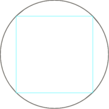

# Polyline Converter

Convert a polyline (a series of points) from one format to another.

Three formats are currently supported:
 - Rectangular (XY graphing coordinates)
 - "Theta-Rho" notation used by [Sisyphus Tables](https://sisyphus-industries.com)
 - G-Code

## Important Note about Rectangular to Theta-Rho Conversion



When converting from the x/y position of rectangular coordinates to the
angle/radius position of polar/Theta-Rho coordinates it is important to remember
that a straight line between two rectangular points will not be a straight line
in polar coordinates. In order to build a straight line in THR coordinates, the
rectangular coordinates must first be subdivided into smaller line segments to
minimize the arcing effect of THR point-to-point segments. This is handled in
this code by passing a second "max_segment_length" parameter to ThetaRho.convert().

## Installation

```
npm install @markroland/polyline-converter
```

## Command Line Usage

```
node ./index.js [input filepath.gcode|rect|thr] [gcode|rect|thr]
```

Tip, if `npm link` has been used you can use: 

```
convert-polyline [input filepath.gcode|rect|thr] [gcode|rect|thr]
```

## Examples

### Convert Theta-Rho to Rectangular

```
node ./index.js rectangle.csv thr
```

### Save Directly to a File

```
node ./index.js rectangle.csv thr > rectangle.thr
```

## Formats

### Theta Rho

Theta-Rho format should have a angular theta value in radians followed by a space followed by a radius/rho value ranging between zero and one.

The center of the drawing area is represented as `0 0`.

The scale for theta-rho units is such that a Rho value of 1 is the maximum radius for the drawing area.

```
3.14 0.5
```

### Rectangular

The Rectangular follows standard X-Y graphing coordinates. An "x" values should be followed by a comma, followed by a "y" value.

The center of the drawing area is represented as `0,0`. Positive "x" is directed to the right and positive "y" is directed to the top.

The scale for rectangular units can be interpreted by the destination. This could be pixels, millimeters, inches or anything really.

```
-100.0,120.0
```

### G-Code

The G-Code line format should start with a "G0" command, followed by "X" and then an numeric value, followed by a space, followed by "Y", followed
by a numeric value.

The origin point of G-Code, `X0 Y0`, is traditionally located in the bottom-left of the drawing area. Therefore all values should be positive.
The center of the drawing area would be represented as halfway between zero and the drawing extent of the plotting device in each direction.

The units for the G-Code should be specified in a preamble to the coordinates. Use `G20` to specify inches or `G21` for millimeters.

```
G0 X100.0 Y100.0
```

In any format, any line staring with a pound sign (#) will be interpreted as a comment that should be ignored.

## License

<a rel="license" href="http://creativecommons.org/licenses/by-sa/4.0/"></a><br />This work is licensed under a <a rel="license" href="http://creativecommons.org/licenses/by-sa/4.0/">Creative Commons Attribution-ShareAlike 4.0 International License</a>.
